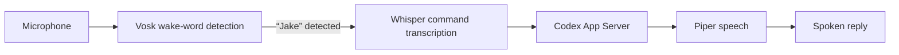

# JKI — Jake Voice Companion

Jake is a voice-controlled Linux desktop companion for Codex. Say **“Jake”** and a command; Jake transcribes it locally, sends the request to an existing Codex conversation, and reads the reply aloud.

> Built for Linux desktops, with a GTK orb, local speech models, and optional music controls.

## How it works



Vosk and Whisper run on your computer. Jake sends only commands spoken after the wake word; it does not save microphone recordings. The wake word is not speaker authentication, so anyone near the microphone may be able to issue commands.

## Features

- Animated GTK orb for listening, working, speaking, offline, and muted states.
- Local Vosk wake-word detection and Whisper command transcription.
- Natural Piper speech, with eSpeak NG as a fallback.
- Voice requests and model switching through the Codex App Server.
- Optional music search and playback with `mpv` and `yt-dlp`, plus player controls through `playerctl`.
- User-level systemd service for automatic startup on Hyprland.

## Requirements

This project currently targets Linux with GTK 4, Hyprland, PipeWire, and Codex's local App Server. It is developed and tested on Arch Linux.

Install system packages that provide:

- GTK 4, Gtk4LayerShell, PyGObject, and Pycairo
- PipeWire's `pw-record` and `pw-play`
- eSpeak NG
- For music controls: `mpv`, `yt-dlp`, and `playerctl`

You also need Python, a working Codex CLI installation, and the local Codex App Server socket for the conversation Jake should use.

## Installation

Clone the repository and install the Python dependencies into a virtual environment that can access the system GTK bindings:

```sh
git clone https://github.com/ridjan-xhika/JKI.git
cd JKI

mkdir -p ~/.local/share/jake-voice ~/.config/jake-voice
cp engine.py jake.py music.py orb.py ~/.local/share/jake-voice/
python -m venv --system-site-packages ~/.local/share/jake-voice/venv
~/.local/share/jake-voice/venv/bin/pip install -r requirements.txt
```

### Download speech models

Download and extract the small US English Vosk model from the [Vosk model list](https://alphacephei.com/vosk/models) into `~/.local/share/jake-voice/`. Whisper's `base.en` model downloads automatically on first run. Install the Piper Lessac voice with:

```sh
~/.local/share/jake-voice/venv/bin/python -m piper.download_voices \
  en_US-lessac-medium --download-dir ~/.local/share/jake-voice/voices
```

### Configure Codex

Copy [`config.example.json`](config.example.json) to `~/.config/jake-voice/config.json`. Replace `USER` in the example paths with your Linux username, set `thread_id` to the Codex conversation to use, and adjust `socket_path` and `codex_path` for your installation.

The example sets `full_access` to `false`, so JKI does not request a permission override. If set to `true`, JKI requests full access for that Codex thread, within your Linux user's permissions; it does not grant root access. Check your normal Codex session permissions as well. The wake word does not distinguish you from another speaker.

### Start automatically on Hyprland

Install and enable the user service:

```sh
mkdir -p ~/.config/systemd/user
cp jake-voice.service ~/.config/systemd/user/
systemctl --user daemon-reload
systemctl --user enable --now jake-voice.service
```

The service starts with `hyprland-session.target`. Your compositor must import its Wayland environment into the systemd user manager before starting that target. Ryoku performs this step during login. Other Hyprland setups may need to configure the environment import themselves.

## Useful commands

```sh
systemctl --user status jake-voice.service
systemctl --user stop jake-voice.service
journalctl --user -u jake-voice.service -f
~/.local/share/jake-voice/venv/bin/python \
  ~/.local/share/jake-voice/jake.py check
```

Run the tests from the repository with:

```sh
python -m unittest
```

## Configuration and model files

`config.example.json` is a template with placeholders. Keep your real configuration, downloaded models, and credentials out of the repository. Model files are not included; download them from their official sources and follow their individual licenses.

## License

JKI source code is released under the [MIT License](LICENSE). Speech models and runtime dependencies have separate licenses.
