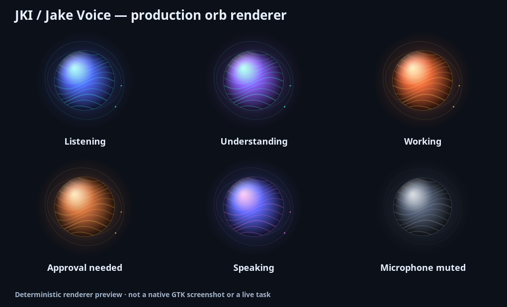

# JKI · Jake Voice

A Linux voice companion for Codex, with local speech processing and visible control over desktop actions.

**0.2.0 development proposal — native desktop/audio and live task integration still require validation.**
JKI is the project name; Jake Voice is the application; “Jake” is the configurable wake name.



## A conversation you can control

Use push-to-talk or a local Vosk wake-word gate. Whisper transcribes locally, then an editable
preview lets you decide what to send. After Codex acknowledges a task, Jake says **“I'm doing it now.”**
Real plan steps, tool activity, and assistant commentary provide progress. Spoken progress is
rate-limited (20 seconds by default); the screen continues to update. There are no invented
percentages, timed promises, or success announcements before a terminal backend event.

Mute microphone, stop speaking, and cancel task are separate controls. Command and file approvals
show their details and require an on-screen decision. Missing details disable acceptance.
Cancellation waits for confirmation and does not claim to undo earlier changes.

## Start here

Install the Linux system dependencies in [INSTALL](docs/INSTALL.md), then from this checkout:

```sh
python3 -m venv --system-site-packages .venv
. .venv/bin/activate
python -m pip install '.[audio]'
jki setup
jki doctor
jki run
```

For Piper output, install `.[audio,piper]` and configure a local voice with its adjacent
`.onnx.json`. Models are **not downloaded by ordinary startup, diagnostics, or transcription**.
Prepare local models or use the explicit hash-verified manifest installer described in
[MODELS](docs/MODELS.md). A curated, verified downloadable model catalog is not bundled yet.

```sh
jki demo                         # Interactive fixture; no mic, backend, or speech output
jki devices                      # Inspect available PipeWire input/output names
jki say --text 'Playback test'    # Explicit test of configured speech output
jki doctor --live --json          # Opt-in read-only local Codex compatibility check
jki run --config /absolute/path/to/config.json
```

The original `python jake.py` entry point remains available. Configuration writes always use
the same path that was loaded, including `--config`.

## Model and reasoning controls

Model and reasoning menus use the live account catalog. Selections are saved and sent explicitly with
each new task, including after reconnects. Say “Use Sol with high reasoning” or “Set reasoning to max.”
Changes apply to the next new task and do not restart ongoing work. See [daily controls](docs/CONTROLS.md).

## Website and documentation

The Jake AI site includes an interactive 3D orb, a responsive landing page, and searchable documentation
built from this repository. The [Pages workflow](.github/workflows/pages.yml) verifies every pull request
and publishes from `main` after a maintainer enables GitHub Actions in Pages settings.
See [website development and deployment](docs/WEBSITE.md).


## Defaults that make the boundaries visible

New setup defaults to restricted permissions, push-to-talk, transcript review, and no transcript
persistence. Optional local media controls are disabled until enabled separately. A wake word is
**not authentication**. Local audio processing does **not** mean the Codex service or media lookup
is offline. Read [PRIVACY](docs/PRIVACY.md) and [SECURITY](SECURITY.md).

## Development

```sh
python -m pip install '.[dev]'
python -m unittest discover -v
python -m pytest
ruff check .
mypy jki/config.py jki/state.py jki/text.py jki/speech_queue.py
python -m build
```

Tests use fake backends, a real local Unix-WebSocket fixture, and owned subprocesses. Live tests
are opt-in. CI includes Python 3.11–3.13, core typing/linting, packaging, and a hardware-free GTK
smoke job. These workflows must run on GitHub before their status can be claimed.

[Architecture](docs/ARCHITECTURE.md) · [Protocol contract](docs/PROTOCOL.md) ·
[Testing and release checks](docs/TESTING.md) · [Performance](docs/PERFORMANCE.md) ·
[Implementation coverage and remaining work](docs/IMPLEMENTATION.md) · [Publishing handoff](docs/PUBLISHING.md)

## License

Source is MIT licensed. Speech models and dependencies have their own licenses. No model weights,
recordings, user configuration, account credentials, or external conversations are distributed here.
