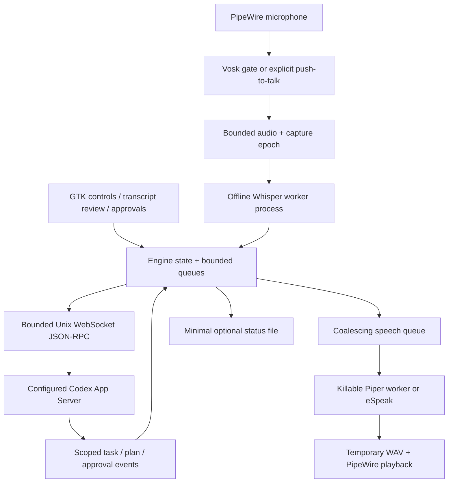

# Architecture

The engine owns shared state under an RLock. Component health, connection, active turn, cancellation,
approvals, and preview are independent; a speech completion cannot mark a broken microphone ready.
Commands and controls use separate workers so a pending RPC does not prevent a cancellation request.

Capture epochs invalidate queued audio and commands across mute/cancel/device changes. A transport
admission guard checks the epoch while holding the engine lock immediately before transmission.
A timed-out request is uncertain, not automatically retried. A delayed accepted turn can be
interrupted once its ID arrives. Reconnect reconciles known turns without replaying user actions.

Limits: 8 commands, 16 controls, 2 accepted audio utterances, 8 coalesced speech jobs, 32 outstanding
RPCs, 1 MiB WebSocket messages, 512 reply IDs, 128 completed/owned IDs, 32 turn/item contexts, 16
pending approvals, and 256 observations per metric. Large backend responses fail visibly rather
than silently increasing limits. Each recording has a configured duration limit (default 30 seconds).

Whisper and Piper run in spawned child processes so cancellation/shutdown can release native model
work. Models stay warm between jobs. Audio subprocesses are terminated, waited on, and escalated
when necessary. The application intentionally does not adopt an autonomous retry loop for actions.
